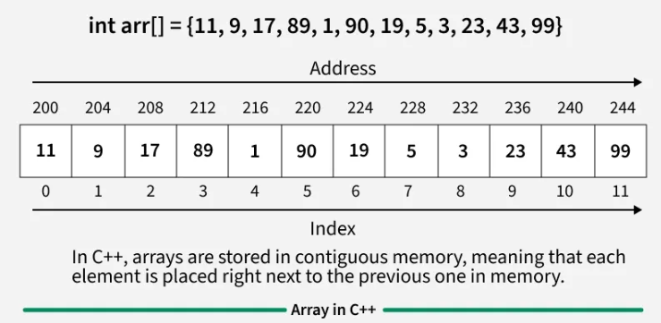
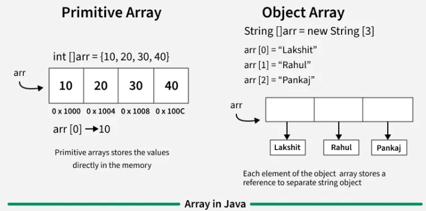
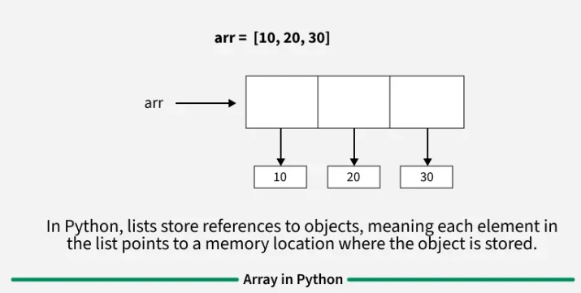
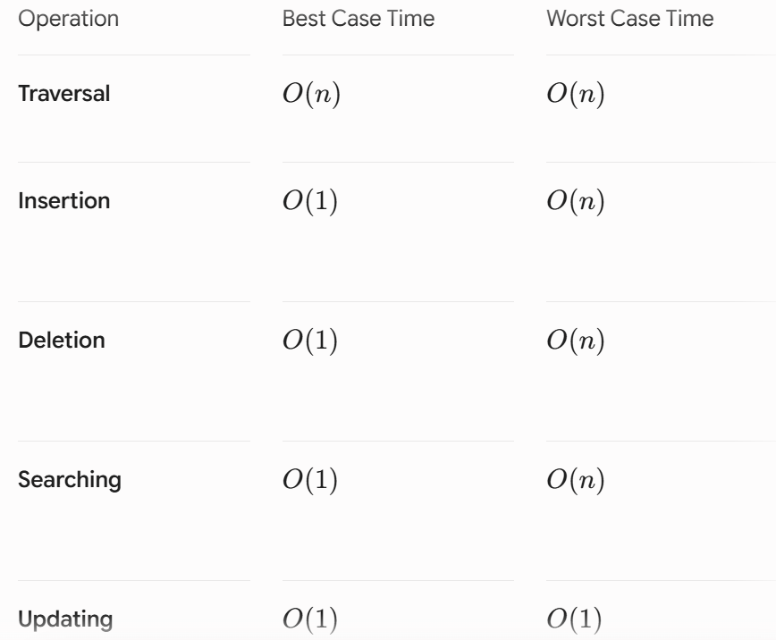
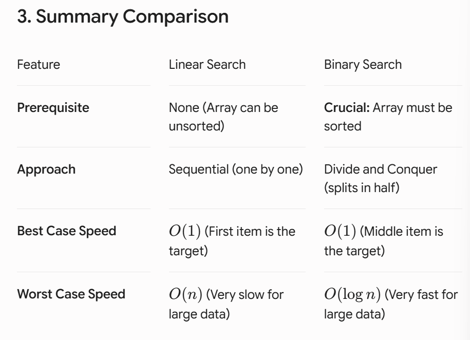

# Arrays

[Home](../../README.md) > [Week 1](../README.md) > Arrays

> Week 1 · Topic 4 of 5 · Prerequisites: [STL](../03-STL/README.md)

---

## Why This Topic Now

Arrays are the simplest and most fundamental data structure. Almost every other data structure - stacks, queues, heaps, hash tables - is built on top of or inspired by arrays. More importantly, the patterns you will practice here (two-pointer, prefix sum, sliding window, Kadane's) appear in the majority of problems across the entire bootcamp.

An array stores items at **contiguous memory locations**, which gives two key advantages:
1. **Random Access** - the i-th item is reachable in O(1) time using its index.
2. **Cache Friendliness** - contiguous memory means the CPU cache works in your favor.

---

## Memory Layout

### C++



### Java



### Python



---

## Basic Operations

### 1. Traversal

Going through the array from start to finish to read, print, or use every element.

#### C++
```cpp
int main() {
    int arr[] = {1, 2, 3, 4, 5};
    int n = sizeof(arr) / sizeof(arr[0]);
    for (int i = 0; i < n; i++) {
        cout << arr[i] << " ";
    }
    return 0;
}
```

#### Java
```java
int[] arr = {1, 2, 3, 4, 5};
for (int i = 0; i < arr.length; i++) {
    System.out.print(arr[i] + " ");
}
```

#### Python
```python
arr = [1, 2, 3, 4, 5]
for i in arr:
    print(i, end=" ")
```

**Time Complexity:** O(n)

---

### 2. Insertion

Adding a new item to the array at the beginning, end, or middle.

> If you insert at the beginning or middle, you must shift all subsequent items right to make room.

#### C++
```cpp
int main() {
    int n = 4;
    vector<int> arr = {10, 20, 30, 40, 0};
    int ele = 50, pos = 2;

    // Shift elements right
    for (int i = n; i >= pos; i--)
        arr[i] = arr[i - 1];

    arr[pos - 1] = ele;

    for (int i = 0; i <= n; i++)
        cout << arr[i] << " ";
    return 0;
}
```

#### Java
```java
int n = 4;
int[] arr = {10, 20, 30, 40, 0};
int ele = 50, pos = 2;

for (int i = n; i >= pos; i--)
    arr[i] = arr[i - 1];

arr[pos - 1] = ele;
```

#### Python
```python
arr = [10, 20, 30, 40, 0]
ele, pos = 50, 2

for i in range(4, pos - 1, -1):
    arr[i] = arr[i - 1]

arr[pos - 1] = ele
```

**Time Complexity:** O(1) at the end, O(n) at the beginning or middle.

---

### 3. Deletion

Removing an item from a specific position.

> After deletion, you must shift all remaining items left to close the gap.

#### C++
```cpp
vector<int> arr = {10, 20, 30, 40};
int pos = 2;
arr.erase(arr.begin() + pos - 1);
```

#### Java
```java
ArrayList<Integer> arr = new ArrayList<>(Arrays.asList(10, 20, 30, 40));
arr.remove(pos - 1);
```

#### Python
```python
arr = [10, 20, 30, 40]
del arr[pos - 1]
```

**Time Complexity:** O(n) because of shifting.

---

### 4. Updating

Changing the value of an existing element at a specific index.

#### C++
```cpp
int arr[5] = {1, 2, 3, 4, 5};
arr[0] = 8;
```

#### Java
```java
int[] arr = {2, 4, 8};
arr[0] = 90;
```

#### Python
```python
prices = [10, 20, 30, 40]
prices[2] = 99
```

**Time Complexity:** O(1) - direct index access.

---

### Operation Complexity Summary



---

## Searching

### Linear Search

Start at index 0 and check each element until you find the target or reach the end.

- Use when the array is unsorted or small.
- Time Complexity: O(n)

### Binary Search

Requires the array to be **sorted**. Repeatedly halve the search range by comparing the target to the middle element.

- Use when the array is large and sorted.
- Time Complexity: O(log n)

Think of it like finding a word in a dictionary - you open to the middle, decide which half the word is in, discard the other half, and repeat.



---

## Important Patterns

These patterns appear constantly across all future weeks. You will learn each one in detail - this is just a preview so you know what to look for.

| Pattern | When to Apply |
|---|---|
| Sliding Window | Optimal subarray/substring of a fixed or variable size |
| Two Pointers | Pairs in sorted arrays, in-place removal, palindrome check |
| Prefix Sum | Repeated range sum queries |
| Kadane's Algorithm | Maximum subarray sum |
| Fast & Slow Pointers | Cycle detection (also applies to Linked Lists) |

---

## Before You Move On

- Can you traverse an array in both forward and reverse order?
- Can you implement linear search from scratch?
- Do you understand why binary search requires a sorted array?
- Can you articulate why insertion at the beginning is O(n) but O(1) at the end?

---

## Additional Resources

- [Application of Arrays - GeeksforGeeks](https://www.geeksforgeeks.org/dsa/array-data-structure-guide/)
- [Vector in C++ STL - GeeksforGeeks](https://www.geeksforgeeks.org/cpp/vector-in-cpp-stl/)
- [Top 50 Array Problems - GeeksforGeeks](https://www.geeksforgeeks.org/dsa/top-50-array-coding-problems-for-interviews/)


> Consider keeping a spreadsheet of every problem you solve in this bootcamp - the problem link, your approach, and the time/space complexity. It will be invaluable during revision.

---

[Previous: Standard Libraries](../03-STL/README.md) | [Week 1 Overview](../README.md) | [Next: Sorting](../05-Sorting/README.md)
