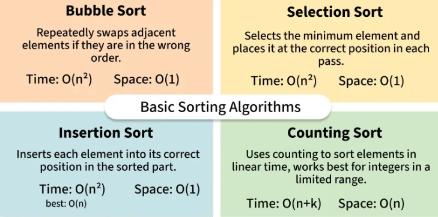

# Sorting Algorithms

[Home](../../README.md) > [Week 1](../README.md) > Sorting

> Week 1 · Topic 5 of 5 · Prerequisites: [Arrays](../04-Arrays/README.md), [Time & Space Complexity](../02-Complexity/README.md)

---

## Why This Topic Now

Sorted data is fundamentally easier to work with. Binary search only works on sorted arrays. Two-pointer technique only works on sorted arrays. Many greedy algorithms assume sorted input. Sorting is the prerequisite that unlocks most of what comes in Week 2 and beyond.

Learn these algorithms in order - the first three you should be able to code from memory. The last two require paper-tracing before coding.

```
Bubble Sort      <- understand the swap-until-sorted idea
    |
Selection Sort   <- understand the find-minimum idea
    |
Insertion Sort   <- understand the expand-sorted-region idea
    |
Merge Sort       <- trace on paper first, then code (divide and conquer)
    |
Quick Sort       <- trace on paper first, then code (pivot partitioning)
```

---

## Types of Sorting

| Type | Description | Examples |
|---|---|---|
| Comparison-based | Elements are compared to determine order | Bubble, Merge, Quick |
| Non-comparison-based | Order determined without direct comparisons | Counting Sort |

---

## Basic Sorting Algorithms



### 1. Bubble Sort

Repeatedly swap adjacent elements that are out of order. After each full pass, the largest unsorted element "bubbles" to its correct position.

- [Theory - GeeksforGeeks](https://www.geeksforgeeks.org/dsa/bubble-sort-algorithm/)
- [Time & Space Complexity Analysis](https://www.geeksforgeeks.org/dsa/time-and-space-complexity-analysis-of-bubble-sort/)
- [Video - Bubble Sort - Striver](https://www.youtube.com/watch?v=HGk_ypEuS24)

**Time Complexity:** O(n²) worst/average, O(n) best (already sorted)
**Space Complexity:** O(1)

---

### 2. Insertion Sort

Build the sorted portion of the array one element at a time by inserting each new element into its correct position in the already-sorted prefix.

- [Theory - GeeksforGeeks](https://www.geeksforgeeks.org/dsa/insertion-sort-algorithm/)
- [Time & Space Complexity Analysis](https://www.geeksforgeeks.org/dsa/time-and-space-complexity-of-insertion-sort-algorithm/)
- [Video - Insertion Sort - Striver](https://www.youtube.com/watch?v=yCxV0kBpA6M)

**Time Complexity:** O(n²) worst/average, O(n) best
**Space Complexity:** O(1)

---

### 3. Selection Sort

Find the minimum element in the unsorted portion and place it at the beginning. Repeat.

- [Theory - GeeksforGeeks](https://www.geeksforgeeks.org/dsa/selection-sort-algorithm-2/)
- [Video - Selection Sort - Striver](https://www.youtube.com/watch?v=Nd4SCCIHFWk)

**Time Complexity:** O(n²) in all cases - two nested loops
**Space Complexity:** O(1)

---

### 4. Counting Sort

Count occurrences of each value, then reconstruct the sorted array. No comparisons needed - works for integer keys in a bounded range.

- [Theory - GeeksforGeeks](https://www.geeksforgeeks.org/dsa/counting-sort/)
- [Video - Counting Sort - Abdul Bari](https://www.youtube.com/watch?v=OKd534EWcdk)

**Time Complexity:** O(N + M) where N = input size, M = range of values
**Space Complexity:** O(N + M)

---

## Advanced Sorting Algorithms

These two are the most important in practice. Both use divide and conquer and run in O(n log n).

### 1. Merge Sort

Recursively divide the array in half, sort each half, then merge the two sorted halves.

The merge step is the key: it combines two sorted arrays into one sorted array in O(n) time. With log n levels of recursion and O(n) work per level, total cost is O(n log n).

> Trace on paper first. Pick an array of 6–8 elements, draw the split tree, then draw the merge steps going back up.

- [Theory - GeeksforGeeks](https://www.geeksforgeeks.org/dsa/merge-sort/)
- [Video - Merge Sort - Striver](https://www.youtube.com/watch?v=ogjf7ORKfd8)

**Time Complexity:** O(n log n) in all cases
**Space Complexity:** O(n) - requires a temporary array during merging

---

### 2. Quick Sort

Pick a pivot element, partition the array so everything smaller is to its left and everything larger is to its right, then recursively sort the two sides.

The partition step is the key: after partitioning, the pivot is in its final sorted position. No merge step needed.

> Trace on paper first. Walk through the Lomuto partition scheme step by step.

- [Theory - GeeksforGeeks](https://www.geeksforgeeks.org/dsa/quick-sort-algorithm/)
- [Time & Space Complexity Analysis](https://www.geeksforgeeks.org/dsa/time-and-space-complexity-analysis-of-quick-sort/)
- [Video - Quick Sort - Striver](https://www.youtube.com/watch?v=WIrA4YexLRQ)

**Time Complexity:** O(n log n) average, O(n²) worst case (bad pivot choice)
**Space Complexity:** O(log n) - call stack

---

## Complexity Comparison

| Algorithm | Best | Average | Worst | Space | Stable |
|---|---|---|---|---|---|
| Bubble Sort | O(n) | O(n²) | O(n²) | O(1) | Yes |
| Selection Sort | O(n²) | O(n²) | O(n²) | O(1) | No |
| Insertion Sort | O(n) | O(n²) | O(n²) | O(1) | Yes |
| Counting Sort | O(N+M) | O(N+M) | O(N+M) | O(N+M) | Yes |
| Merge Sort | O(n log n) | O(n log n) | O(n log n) | O(n) | Yes |
| Quick Sort | O(n log n) | O(n log n) | O(n²) | O(log n) | No |

---

## Extra Algorithms (Optional)

These are less commonly tested but worth knowing exist:

- [Cycle Sort](https://www.geeksforgeeks.org/dsa/cycle-sort/)
- [Heap Sort](https://www.geeksforgeeks.org/dsa/heap-sort/)
- [Radix Sort](https://www.geeksforgeeks.org/dsa/radix-sort/)

---

## Before You Move On

- Can you code Bubble Sort from memory?
- Can you explain why Merge Sort is O(n log n)?
- Can you describe what the partition step does in Quick Sort?
- Do you know when to prefer Merge Sort over Quick Sort?

---

## Additional Resources

- [Sorting in STL (C++)](https://www.geeksforgeeks.org/cpp/sort-c-stl/)
- [Sorting in Java](https://www.geeksforgeeks.org/java/arrays-sort-in-java/)
- [Sorting a Rotated Sorted Array](https://www.geeksforgeeks.org/dsa/sort-rotated-sorted-array/)
- [Searching in a Rotated Sorted Array](https://leetcode.com/problems/search-in-rotated-sorted-array/description/)
- [Interview Questions on Sorting](https://www.geeksforgeeks.org/dsa/commonly-asked-data-structure-interview-questions-on-sorting/)


---

[Previous: Arrays](../04-Arrays/README.md) | [Week 1 Overview](../README.md) | [Next: Week 2](../../Week-2/README.md)
