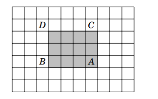

# Prefix Sum

[Home](../../README.md) > [Week 2](../README.md) > Prefix Sum

> Week 2 · Topic 1 of 4 · Prerequisites: [Arrays](../../Week-1/04-Arrays/README.md)

---

## Why This Topic Now

You know arrays. The naive way to compute the sum of any subarray is to loop through it - O(n) per query. If someone asks you for 10,000 subarray sums on the same array, that is O(n × 10,000).

Prefix sum changes this. You preprocess the array once in O(n), then answer every range sum query in O(1). This is the first concrete example of a fundamental DSA trade-off: **spend memory now, save time later**.

This mindset - precompute once, query fast - appears throughout dynamic programming and many other advanced topics.

---

## The Problem

Given an array, efficiently find the sum of any subarray `[a, b]`.

```
Index:  0 1 2 3 4 5 6 7
Array: [1 3 4 8 6 1 4 2]
```

Naive approach: loop from index `a` to `b` each time → O(n) per query.

---

## Building the Prefix Sum Array

Define:
```
prefix[i] = sum of elements from index 0 to i
```

So:
```
prefix[0] = arr[0]
prefix[1] = arr[0] + arr[1]
prefix[2] = arr[0] + arr[1] + arr[2]
...
```

For the example array:
```
Index:   0  1  2  3  4  5  6  7
Array:   1  3  4  8  6  1  4  2
Prefix:  1  4  8 16 22 23 27 29
```

---

## Range Sum Formula

To find `sum(a, b)`:

```
sum(a, b) = prefix[b] - prefix[a-1]
```

Special case - if `a = 0`:
```
sum(0, b) = prefix[b]
```

**Example:** Find `sum(3, 6)`.
```
prefix[6] = 27
prefix[2] = 8
sum(3, 6) = 27 - 8 = 19
```

Check: `8 + 6 + 1 + 4 = 19`. Correct.

**Why it works:**
```
prefix[6] = 1+3+4+8+6+1+4
prefix[2] = 1+3+4
prefix[6] - prefix[2] = 8+6+1+4   <- only the range we wanted
```

---

## Implementation

### C++
```cpp
// Build
vector<int> arr = {1, 3, 4, 8, 6, 1, 4, 2};
int n = arr.size();
vector<int> prefix(n);
prefix[0] = arr[0];
for (int i = 1; i < n; i++)
    prefix[i] = prefix[i-1] + arr[i];

// Query
int rangeSum(int l, int r, vector<int>& prefix) {
    if (l == 0) return prefix[r];
    return prefix[r] - prefix[l-1];
}
```

### Python
```python
arr = [1, 3, 4, 8, 6, 1, 4, 2]
n = len(arr)
prefix = [0] * n
prefix[0] = arr[0]
for i in range(1, n):
    prefix[i] = prefix[i-1] + arr[i]

def range_sum(l, r):
    if l == 0:
        return prefix[r]
    return prefix[r] - prefix[l-1]
```

### Java
```java
int[] arr = {1, 3, 4, 8, 6, 1, 4, 2};
int n = arr.length;
int[] prefix = new int[n];
prefix[0] = arr[0];
for (int i = 1; i < n; i++)
    prefix[i] = prefix[i-1] + arr[i];

int rangeSum(int l, int r) {
    if (l == 0) return prefix[r];
    return prefix[r] - prefix[l-1];
}
```

**Time Complexity:**

| Operation | Complexity |
|---|---|
| Build prefix array | O(n) |
| Each range query | O(1) |

---

## 2D Prefix Sum

The same idea extends to matrices. Given a grid, answer rectangle sum queries in O(1) after O(n×m) preprocessing.

**Definition:**
```
prefix[i][j] = sum of all elements from (0,0) to (i,j)
```

**Build formula:**
```
prefix[i][j] = arr[i][j] + prefix[i-1][j] + prefix[i][j-1] - prefix[i-1][j-1]
```

The subtraction removes the overlap that gets counted twice.

**Rectangle query - `(top, left)` to `(bottom, right)`:**



```
sum = prefix[bottom][right]
    - prefix[top-1][right]     (if top > 0)
    - prefix[bottom][left-1]   (if left > 0)
    + prefix[top-1][left-1]    (if top > 0 and left > 0)
```

### C++
```cpp
int n, m;
vector<vector<int>> arr(n, vector<int>(m));
vector<vector<int>> prefix(n, vector<int>(m));

for (int i = 0; i < n; i++) {
    for (int j = 0; j < m; j++) {
        prefix[i][j] = arr[i][j];
        if (i > 0) prefix[i][j] += prefix[i-1][j];
        if (j > 0) prefix[i][j] += prefix[i][j-1];
        if (i > 0 && j > 0) prefix[i][j] -= prefix[i-1][j-1];
    }
}

// Query
int sum = prefix[bottom][right];
if (top > 0) sum -= prefix[top-1][right];
if (left > 0) sum -= prefix[bottom][left-1];
if (top > 0 && left > 0) sum += prefix[top-1][left-1];
```

**Time Complexity:**

| Operation | Complexity |
|---|---|
| Build 2D prefix sum | O(n × m) |
| Rectangle query | O(1) |

---

## When to Recognize a Prefix Sum Problem

- The problem asks for sums of subarrays or submatrices repeatedly
- Keywords: "range sum", "subarray sum", "sum from i to j"
- A brute force solution would use nested loops to recompute sums

---

## Common Applications

**1D:** Range sum queries, frequency counting, difference arrays, subarray problems

**2D:** Matrix sum queries, image processing, grid problems

---

## Before You Move On

- Can you build a prefix array from scratch?
- Can you answer a range sum query in O(1) using the formula?
- Do you understand why `prefix[b] - prefix[a-1]` gives `sum(a, b)`?

---

## Resources

- [Prefix Sum - GeeksforGeeks](https://www.geeksforgeeks.org/prefix-sum-array-implementation-applications-competitive-programming/)
- [CF Blog on Prefix Sum](https://codeforces.com/blog/entry/146389)

### Video Resources

- [Prefix Sum - Striver (takeUforward)](https://www.youtube.com/watch?v=xvNwoz-ufXA)
- [2D Prefix Sum - Errichto](https://www.youtube.com/watch?v=PhgtNY_-CiY)

---

[Week 2 Overview](../README.md) | [Next: Two Pointers](../02-Two-Pointers/README.md)
