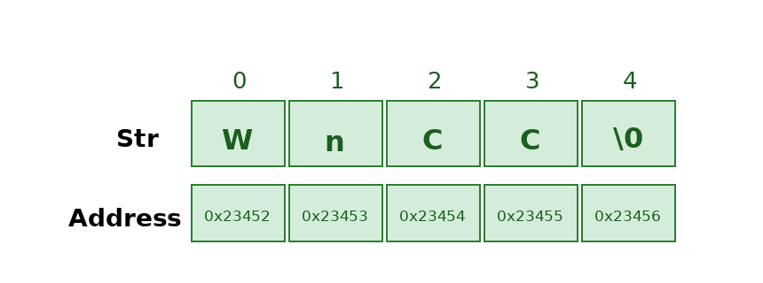

# Strings

[Home](../../README.md) > [Week 2](../README.md) > Strings

> Week 2 · Topic 4 of 4 · Prerequisites: [Arrays](../../Week-1/04-Arrays/README.md), [Two Pointers](../02-Two-Pointers/README.md)

---

## Why This Topic Now

A string is just an array of characters. Everything you know about array traversal, two pointers, prefix sums, and searching applies directly to strings. The main differences are in how languages store and mutate strings, and a handful of string-specific operations you need to know.

---

## Strings as Arrays

At their core, strings are sequences of characters stored in memory. The patterns you already know transfer directly:

| Array Pattern | String Application |
|---|---|
| Two pointers (opposite ends) | Palindrome check |
| Sliding window | Longest substring without repeating characters |
| Prefix sum / frequency array | Anagram detection, character counts |
| Binary search | Search in a sorted list of strings |

---

## Memory Representation

### C++
Supports both C-style character arrays and `std::string`. The `std::string` class is mutable - you can change individual characters.

### Python
Strings are **immutable** - you cannot modify a character in-place. To "change" a string, you build a new one.

### Java
Strings are **immutable** objects of the `String` class. Use `StringBuilder` when you need to build strings incrementally - it is much faster than concatenating with `+` in a loop.



---

## Mutability

**C++** - `std::string` is mutable:
```cpp
const char* str = "Hello";
str[0] = 'h';  // Error: read-only
// But std::string is mutable:
string s = "Hello";
s[0] = 'h';   // OK
```

**Java** - immutable:
```java
String s1 = "java";
s1.concat(" rules");   // s1 is unchanged - concat returns a new string
System.out.println(s1);   // "java"
```

**Python** - immutable:
```python
s = "WnCC"
s[1] = 'f'   # TypeError - strings are immutable
```

---

## Declaration

**C++**
```cpp
string str1 = "Welcome to the DSA Bootcamp";
string str2("WnCC");
cout << str1 << endl << str2;
```

**Java**
```java
String s = "WnCC";
String s1 = new String("WnCC");
```

**Python**
```python
s1 = 'Welcome to the DSA Bootcamp'   # single quotes
s2 = "WnCC"                           # double quotes
s3 = '''Multi
line string'''
```

---

## Accessing Characters

**C++**
```cpp
string str = "Hello World";
cout << str[0] << endl;        // 'H'
cout << str.at(6) << endl;     // 'W' - bounds checked
```

**Java**
```java
String str = "Hello World";
System.out.println(str.charAt(0));   // 'H'
System.out.println(str.charAt(6));   // 'W'
```

**Python**
```python
str = "Hello World"
print(str[0])    # 'H'
print(str[6])    # 'W'
```

---

## Basic Operations

### Length

**C++:** `s.size()` or `s.length()`
**Java:** `s.length()`
**Python:** `len(s)`

---

### Check for Equality

**C++**
```cpp
bool areStringsSame(string s1, string s2) {
    return s1 == s2;
}
```

**Java**
```java
// Use .equals(), not ==
boolean same = s1.equals(s2);
```

**Python**
```python
same = s1 == s2
```

---

### Search for a Character

**C++**
```cpp
int findChar(string& s, char ch) {
    for (int i = 0; i < s.length(); i++)
        if (s[i] == ch) return i;
    return -1;
}
```

**Java**
```java
static int findChar(String s, char ch) {
    for (int i = 0; i < s.length(); i++)
        if (s.charAt(i) == ch) return i;
    return -1;
}
```

**Python**
```python
def findChar(s, ch):
    for i in range(len(s)):
        if s[i] == ch: return i
    return -1
```

---

### Insert a Character

**C++**
```cpp
s.insert(s.begin() + pos, c);
```

**Java**
```java
StringBuilder sb = new StringBuilder("WnCC");
sb.insert(3, 'A');
System.out.println(sb.toString());
```

**Python**
```python
def insertChar(s, c, pos):
    return s[:pos] + c + s[pos:]
```

---

### Remove a Character

**C++**
```cpp
s.erase(pos, 1);
```

**Java**
```java
StringBuilder s = new StringBuilder("abcde");
s.deleteCharAt(1);
```

**Python**
```python
def remove_char(s, pos):
    return s[:pos] + s[pos+1:]
```

---

### Remove All Occurrences

**C++**
```cpp
s.erase(remove(s.begin(), s.end(), c), s.end());
```

**Java**
```java
s = s.replace(String.valueOf(c), "");
```

**Python**
```python
s = s.replace(c, '')
```

---

### Concatenation

**C++**
```cpp
string res = s1 + s2;
```

**Java**
```java
String res = s1 + s2;
// For building strings in a loop, prefer:
StringBuilder sb = new StringBuilder();
sb.append(s1);
sb.append(s2);
```

**Python**
```python
res = s1 + s2
# For building in a loop, prefer:
res = ''.join([s1, s2, ...])
```

---

### Reverse a String

**C++**
```cpp
string reverseString(string& s) {
    string res;
    for (int i = s.size() - 1; i >= 0; i--)
        res += s[i];
    return res;
}
```

**Java**
```java
static String reverseString(String s) {
    return new StringBuilder(s).reverse().toString();
}
```

**Python**
```python
def reverseString(s):
    return s[::-1]
```

---

### Rotate a String

Rotating shifts characters to the left or right by a given number of positions, with wrapping.

[Rotate a String - GeeksforGeeks](https://www.geeksforgeeks.org/dsa/left-rotation-right-rotation-string-2/)

---

### Generate All Substrings

[Generate all Substrings - GeeksforGeeks](https://www.geeksforgeeks.org/dsa/program-print-substrings-given-string/)

---

### Palindrome Check

A string is a palindrome if it reads the same forward and backward. Classic two-pointer problem: compare `s[left]` and `s[right]`, move toward the center.

[Check for Palindrome - GeeksforGeeks](https://www.geeksforgeeks.org/dsa/palindrome-string/)

---

## Before You Move On

- Can you reverse a string in each of your chosen languages?
- Do you understand why Java strings are immutable and when to use `StringBuilder`?
- Can you check if a string is a palindrome using two pointers?
- Can you count character frequencies using a hash map?

---

## Resources

- [Strings in C++ - GeeksforGeeks](https://www.geeksforgeeks.org/cpp/strings-in-cpp/)
- [Strings in Java - GeeksforGeeks](https://www.geeksforgeeks.org/java/strings-in-java/)
- [Strings in Python - GeeksforGeeks](https://www.geeksforgeeks.org/python/python-string/)
- [Top 50 String Problems - GeeksforGeeks](https://www.geeksforgeeks.org/dsa/top-50-string-coding-problems-for-interviews/)

### Video Resources

- [Strings in C++ - Striver (takeUforward)](https://www.youtube.com/watch?v=vLt-IyTmnkc)
- [String Methods in Python - Corey Schafer](https://www.youtube.com/watch?v=k9TUPpGqYTo)
- [String Problems Playlist - NeetCode](https://www.youtube.com/playlist?list=PLot-Xpze53ldVwtstag2TL4HQhAnC8ATf)

---

[Previous: Binary Search](../03-Binary-Search/README.md) | [Week 2 Overview](../README.md) | [Next: Week 3](../../Week-3/README.md)
