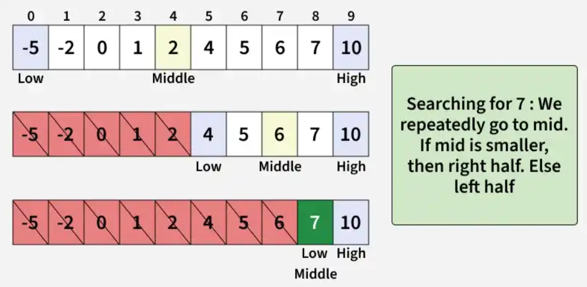
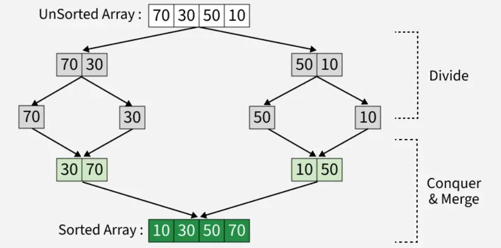
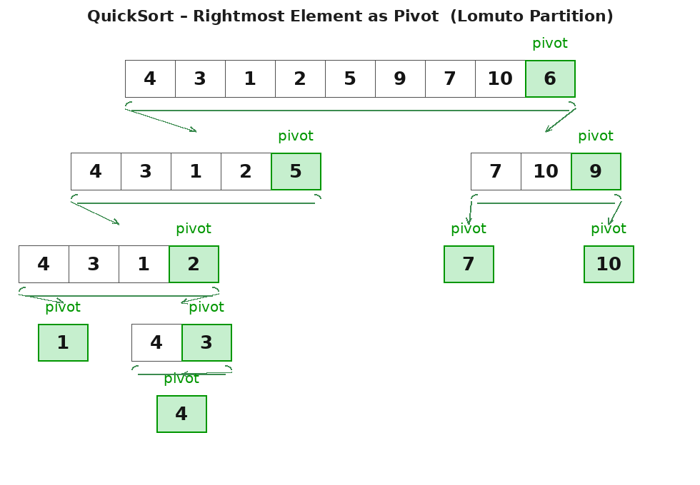
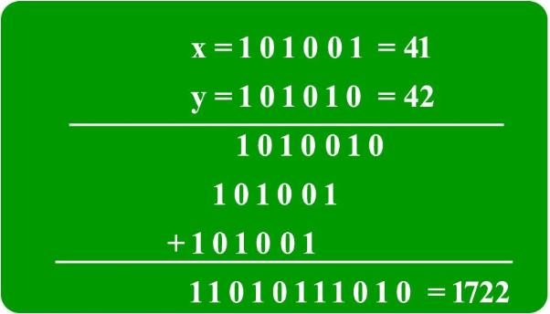
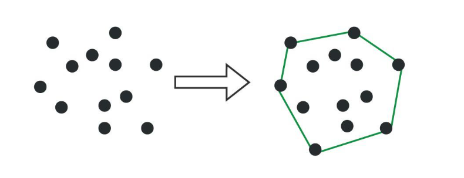

# Divide and Conquer

[Home](../../README.md) > [Week 3](../README.md) > Divide & Conquer

> Week 3 · Topic 2 of 4 · Prerequisites: [Recursion](../01-Recursion/README.md), [Sorting](../../Week-1/05-Sorting/README.md)

---

## Why This Topic Now

Recursion lets you split a problem. Divide & Conquer formalizes *when* and *how* splitting is efficient. The recurrence `T(n) = 2T(n/2) + O(n)` resolves to O(n log n) - this is exactly why Merge Sort beats Bubble Sort at scale.

Understanding D&C also directly applies to Binary Search (which you already know) and is the prerequisite for understanding the Master Theorem used to analyze any recursive algorithm.

---

## The Three Steps

### Divide
Break the original problem into smaller subproblems. Each subproblem should represent a part of the overall problem. Continue dividing until no further division is possible.

### Conquer
Solve each subproblem individually. If a subproblem is small enough (the base case), solve it directly without further recursion.

### Merge
Combine the solutions of subproblems to form the solution for the larger problem.

---

## Complexity - The Recurrence Relation

```
T(n) = a·T(n/b) + f(n)
```

Where:
- `n` = input size
- `a` = number of subproblems
- `n/b` = size of each subproblem
- `f(n)` = cost of dividing and merging

---

## Standard Algorithms

### Binary Search

Binary search is a D&C algorithm that discards half the search space at every step. You covered this in detail in Week 2.

- Divides: the array into two halves
- Conquers: only the relevant half
- Merges: nothing - returns directly

**Time Complexity:** O(log n)



### C++
```cpp
int binarySearch(vector<int>& arr, int x) {
    int low = 0, high = arr.size() - 1;
    while (low <= high) {
        int mid = low + (high - low) / 2;
        if (arr[mid] == x) return mid;
        if (arr[mid] < x) low = mid + 1;
        else high = mid - 1;
    }
    return -1;
}
```

### Java
```java
static int binarySearch(int arr[], int x) {
    int low = 0, high = arr.length - 1;
    while (low <= high) {
        int mid = low + (high - low) / 2;
        if (arr[mid] == x) return mid;
        if (arr[mid] < x) low = mid + 1;
        else high = mid - 1;
    }
    return -1;
}
```

### Python
```python
def binarySearch(arr, x):
    low, high = 0, len(arr) - 1
    while low <= high:
        mid = low + (high - low) // 2
        if arr[mid] == x: return mid
        elif arr[mid] < x: low = mid + 1
        else: high = mid - 1
    return -1
```

---

### Merge Sort

Recursively divide the array in half, sort each half, then merge the two sorted halves.

The merge step runs in O(n). With log n recursive levels, total cost is O(n log n).



### C++
```cpp
void merge(vector<int>& arr, int left, int mid, int right) {
    int n1 = mid - left + 1, n2 = right - mid;
    vector<int> L(n1), R(n2);

    for (int i = 0; i < n1; i++) L[i] = arr[left + i];
    for (int j = 0; j < n2; j++) R[j] = arr[mid + 1 + j];

    int i = 0, j = 0, k = left;
    while (i < n1 && j < n2)
        arr[k++] = (L[i] <= R[j]) ? L[i++] : R[j++];
    while (i < n1) arr[k++] = L[i++];
    while (j < n2) arr[k++] = R[j++];
}

void mergeSort(vector<int>& arr, int left, int right) {
    if (left >= right) return;
    int mid = left + (right - left) / 2;
    mergeSort(arr, left, mid);
    mergeSort(arr, mid + 1, right);
    merge(arr, left, mid, right);
}
```

### Java
```java
static void merge(int arr[], int l, int m, int r) {
    int n1 = m - l + 1, n2 = r - m;
    int[] L = new int[n1], R = new int[n2];
    for (int i = 0; i < n1; i++) L[i] = arr[l + i];
    for (int j = 0; j < n2; j++) R[j] = arr[m + 1 + j];
    int i = 0, j = 0, k = l;
    while (i < n1 && j < n2) arr[k++] = (L[i] <= R[j]) ? L[i++] : R[j++];
    while (i < n1) arr[k++] = L[i++];
    while (j < n2) arr[k++] = R[j++];
}

static void mergeSort(int arr[], int l, int r) {
    if (l < r) {
        int m = l + (r - l) / 2;
        mergeSort(arr, l, m);
        mergeSort(arr, m + 1, r);
        merge(arr, l, m, r);
    }
}
```

### Python
```python
def merge(arr, left, mid, right):
    L = arr[left:mid+1]
    R = arr[mid+1:right+1]
    i = j = 0
    k = left
    while i < len(L) and j < len(R):
        if L[i] <= R[j]:
            arr[k] = L[i]; i += 1
        else:
            arr[k] = R[j]; j += 1
        k += 1
    while i < len(L): arr[k] = L[i]; i += 1; k += 1
    while j < len(R):  arr[k] = R[j]; j += 1; k += 1

def mergeSort(arr, left, right):
    if left < right:
        mid = (left + right) // 2
        mergeSort(arr, left, mid)
        mergeSort(arr, mid + 1, right)
        merge(arr, left, mid, right)
```

---

### Quick Sort

Pick a pivot, partition the array so all elements smaller than the pivot are on its left and all larger elements are on its right, then recursively sort the two sides.

Unlike Merge Sort, Quick Sort does its work during partitioning - no merge step needed.



### C++
```cpp
int partition(vector<int>& arr, int low, int high) {
    int pivot = arr[high], i = low - 1;
    for (int j = low; j <= high - 1; j++)
        if (arr[j] < pivot) swap(arr[++i], arr[j]);
    swap(arr[i + 1], arr[high]);
    return i + 1;
}

void quickSort(vector<int>& arr, int low, int high) {
    if (low < high) {
        int pi = partition(arr, low, high);
        quickSort(arr, low, pi - 1);
        quickSort(arr, pi + 1, high);
    }
}
```

### Java
```java
static int partition(int[] arr, int low, int high) {
    int pivot = arr[high], i = low - 1;
    for (int j = low; j <= high - 1; j++)
        if (arr[j] < pivot) { int t = arr[++i]; arr[i] = arr[j]; arr[j] = t; }
    int t = arr[i + 1]; arr[i + 1] = arr[high]; arr[high] = t;
    return i + 1;
}

static void quickSort(int[] arr, int low, int high) {
    if (low < high) {
        int pi = partition(arr, low, high);
        quickSort(arr, low, pi - 1);
        quickSort(arr, pi + 1, high);
    }
}
```

### Python
```python
def partition(arr, low, high):
    pivot = arr[high]
    i = low - 1
    for j in range(low, high):
        if arr[j] < pivot:
            i += 1
            arr[i], arr[j] = arr[j], arr[i]
    arr[i + 1], arr[high] = arr[high], arr[i + 1]
    return i + 1

def quickSort(arr, low, high):
    if low < high:
        pi = partition(arr, low, high)
        quickSort(arr, low, pi - 1)
        quickSort(arr, pi + 1, high)
```

---

### Strassen's Matrix Multiplication

Given two matrices, compute their product using D&C to reduce the naive O(n³) to approximately O(n^2.81).

### C++
```cpp
vector<vector<int>> multiply(vector<vector<int>>& mat1, vector<vector<int>>& mat2) {
    int n = mat1.size(), m = mat1[0].size(), q = mat2[0].size();
    vector<vector<int>> res(n, vector<int>(q, 0));
    for (int i = 0; i < n; i++)
        for (int j = 0; j < q; j++)
            for (int k = 0; k < m; k++)
                res[i][j] += mat1[i][k] * mat2[k][j];
    return res;
}
```

---

## Advanced Algorithms (Optional)

These are more complex and can be skipped on first pass:

### Karatsuba Algorithm (Fast Multiplication)

Reduces multiplication of two n-digit numbers from O(n²) to approximately O(n^1.585) by computing only 3 multiplications instead of 4.

- Split each number into left and right halves
- Compute P1 = Xl × Yl, P2 = Xr × Yr, P3 = (Xl+Xr) × (Yl+Yr)
- Combine: X×Y = P1 × 2^(2×sh) + (P3-P1-P2) × 2^sh + P2



[Code - GeeksforGeeks](https://www.geeksforgeeks.org/dsa/karatsuba-algorithm-for-fast-multiplication-using-divide-and-conquer-algorithm/)

---

### Convex Hull

The smallest convex polygon containing a given set of points. Solved with D&C by recursively computing the hull for two halves and merging via tangent lines.



[Code - GeeksforGeeks](https://www.geeksforgeeks.org/dsa/convex-hull-using-divide-and-conquer-algorithm/)

---

## Before You Move On

- Can you trace through Merge Sort on paper for a 6-element array?
- Can you explain what the partition step in Quick Sort does?
- Do you understand why Merge Sort is always O(n log n) but Quick Sort can degrade to O(n²)?
- Can you explain the recurrence `T(n) = 2T(n/2) + O(n)` and why it resolves to O(n log n)?

---

## Resources

- [Divide and Conquer - GeeksforGeeks](https://www.geeksforgeeks.org/dsa/divide-and-conquer/)

### Video Resources

- [Masters Theorem - Abdul Bari](https://www.youtube.com/watch?v=OynWkEj0S-s)
- [Divide and Conquer - Abdul Bari](https://www.youtube.com/watch?v=2Rr2tW9zvRg)

---

[Previous: Recursion](../01-Recursion/README.md) | [Week 3 Overview](../README.md) | [Next: Hashing](../03-Hashing/README.md)
